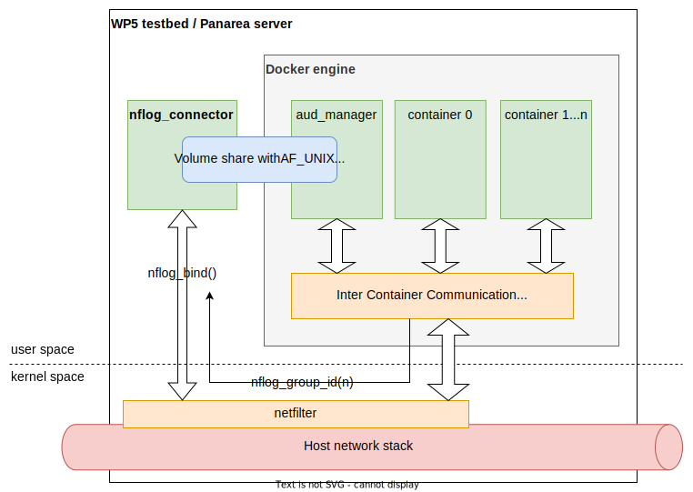

# !!! This documentation is severely outdated !!!

# WP4 Analytic: AUD Manager

## Deploying

### AUD Manager in a container

AUD Manager is intended to run in a docker container. The Dockerfile at the root of this repo describes the container. Building and executing it should be as simple as:

    $ docker build -t aud_manager .
    $ docker run -d --cap-add NET_ADMIN --net sifis_net         \
          --privileged --ip 172.18.10.2 --publish 5000:5000     \
          --mount type=bind,source="/tmp/aud",target="/tmp/aud" \
          --name aud_manager aud_manager

Note that data acquisition (described below) has to be in place before starting the container.

### Description of data acquisition

AUD Manager gets its input data through nflog. However, due to the network isolation of docker an nflog iptable tap/rule cannot be done inside a container. A suitable place to add the rule in `filter` table's `DOCKER_USER` chain directly on the docker host machine, i.e., the WP5 panarea server. To convey the acquired packets to AUD Manager running inside a container we use a local socket (AF_UNIX) which we share through a volume. This functionality is implemented in `aud_manager/data_intake_modules/nflog_connector`. The integration diagram below illustrates this technical workaround.

How to deploy nflog_connector (as superuser):

    $ iptables -t filter -I DOCKER-USER -j NFLOG --nflog-group 7 --nflog-threshold 10
    $ aud_manager/data_intake_modules/nflog_connector/nflog > /dev/null &

## AUD Manager system integration diagram

## Startup wrapper "aud_control.sh"

This script is for controlling local startup and teardown. It is mostly useful while developing the analytic, but may also be used as a reference on how AUD Manager is intended to run.

## REST API of AUD Manager

Description of the various REST endpoint available while AUD Manager is running.

---

#### GET /start

Description: Start the internal network analytic.

Sample: `curl http://aud_manager:5000/start`

---

#### GET /stop

Description: Stop the internal network analytic.

Sample: `curl http://aud_manager:5000/stop`

---

#### GET /status

Description: Return the status of the currently running analytic.

Sample: `curl http://aud_manager:5000/status`

---

#### GET /connlist

Description: Return a list of all connections tracked by the analytic.

Sample: `curl http://aud_manager:5000/connlist`

---

#### GET /endpoints

Description: Return a list of all endpoints (i.e., hosts) that the analytic has seen since the analytic was started.

Sample: `curl http://aud_manager:5000/endpoints`

---

#### GET /aud-file/{ip}

Description: Return a JSON object representing the current AUD file for the given IP. Protocol version can be either v4 or v6.

Sample: `curl http://aud_manager:5000/aud-file/172.18.10.123`
